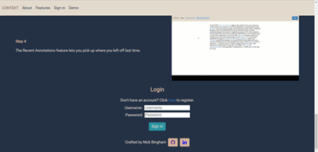
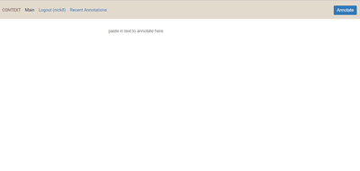
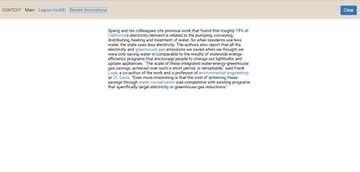
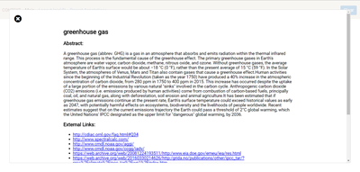
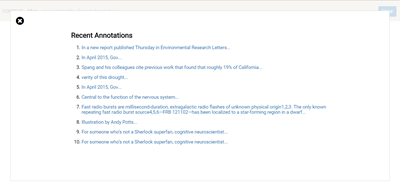

# Context

Context is a responsive, full-stack app that allows users to annotate a text's named entities with Wikipedia summaries (called abstracts) and external websites.

## Live Website

[http://contextservice.site/#](http://contextservice.site/#)

## Summary

Context was built around the idea that a user's reading experience on the web could be improved by providing, you guessed it, more context to the content being read.  By providing a brief (and sometimes not so brief) abstract (or definition, really) to a highlighted named entity along with external links to websites about that named entity, it is my hope that the user gets some added benefit. Context is an annotation service to take content from the web and add annotations. [This](https://github.com/EnshaednHiker/context) is the main entry point for the project with a detailed tutorial on both the server and web client.

Perfect use case: you a lay person is trying to muddle through an article from the journal *Nature*, but you don't understand every tenth word. Context can take articles written for specialists and turn them into something more readable for the lay person.

Context is comprised of two main components: [server](https://github.com/EnshaednHiker/context-server) and [webclient](https://github.com/EnshaednHiker/context-webclient).

## Screenshots








# Webclient

## Getting Started

### Installing

```
>   git clone https://github.com/EnshaednHiker/context-webclient.git
>   cd context-webclient
>   npm install
>   npm run postinstall
```

### Launching

```
> npm start
```

Then open `localhost:3000` in browser. You'll also need to run the [Context-Server](https://github.com/EnshaednHiker/context-server) with:

```
> npm start
```

### Testing

```
> npm test
```
Tests use Selenium and [nightwatch.js](http://nightwatchjs.org/) to test the site with end to end testing.

## Continuous Integration 

[CircleCI](https://circleci.com/) used with [Netlify](https://www.netlify.com/docs/) to keep keep continuous integration chugging along.

### Security

User credentials are encrypted with [jsonwebtokens](https://github.com/auth0/node-jsonwebtoken) and submitted with [superagent](https://github.com/visionmedia/superagent)

## Client Built With

* HTML5/CSS3/Javascript(ES6 and up via Babel)
* [REACT](https://reactjs.org/docs/hello-world.html) - The web framework used by, like, everybody
* [REDUX](https://redux.js.org/) - Handles centralized store of state
* [WEBPACK](https://webpack.js.org/guides/getting-started/) - Sane building of assets and transpiling of code
* [DIRECTOR](https://github.com/flatiron/director) - Framework agnostic routing
* [FONT AWESOME](http://fontawesome.io/) - Social media icons be needed
* [NORMALIZE.CSS](https://necolas.github.io/normalize.css/) - Browsers need centralized wrangling
* [DBPEDIA SPOTLIGHT](http://www.dbpedia-spotlight.org/) - handles named entity recognition and finding abstracts and external links

## Development Roadmap

* Retain paragraph separation in returned annotated strings
* Collapsible hamburger menu for mobile view
* Build proxy server of DBPedia Spotlight for avoid running the site in http issue. Currently, I have to host the site in http, not https, in order to access the DBPedia Spotlight API
* Social media elements with blog roll that shows user annotations
* Sharing social media site elements where study meets social media

## Author

* **Nick Bingham** - [EnshaednHiker](https://github.com/EnshaednHiker)

## License

This project is licensed under the ISC License - see the [LICENSE.md](LICENSE.md) file for details

## Acknowledgments

* Hat tip to my mentors who helped to keep me mostly sane, my goals lofty but in reach, and on track.